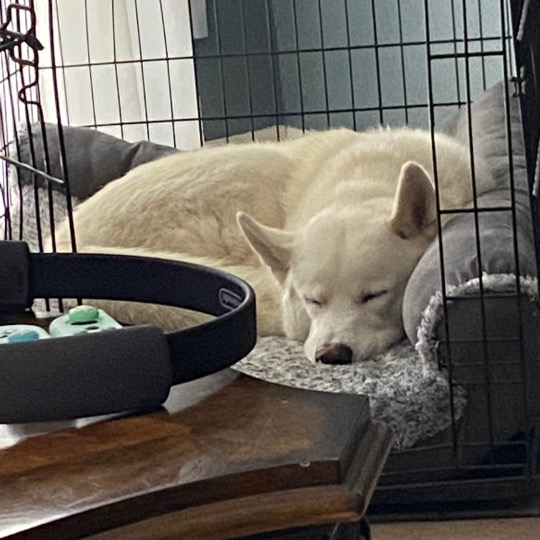

```{R echo=F, eval=F}
#to build this website into the _site directory, run
rmarkdown::site_generator()
```
 


<br>

# Hello and welcome! My name is Jess. 
  
</br>

##### I am currently a Psychology senior at UT Austin, with a minor in Educational Psychology.

##### Born and raised in Houston and am the owner of a troublemaking husky mix named Junior, who you can see sleeping below.

##### Like Bevo, I also do not hold any more advanced degrees but hope to attain a Master's someday after graduation.  

##### I don't have any data-related projects either, but if I did you could find them [here](/portfolio)!

</br>



---
